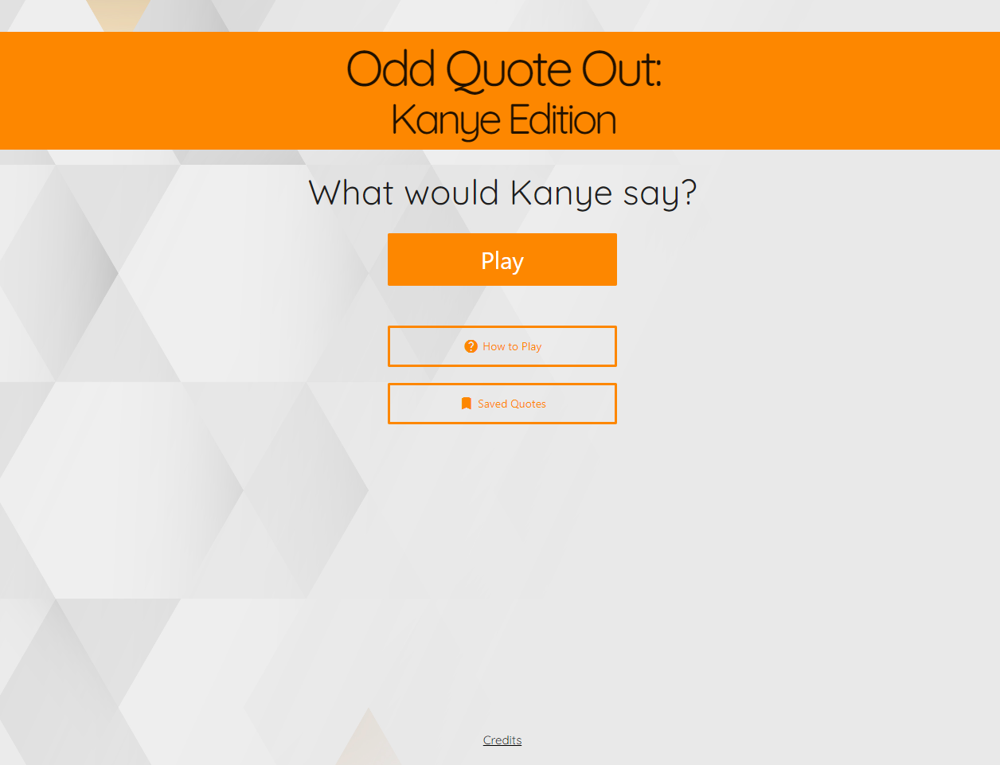
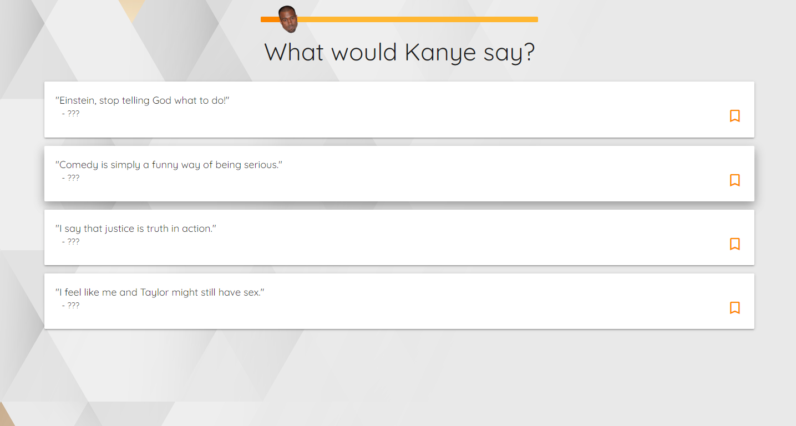
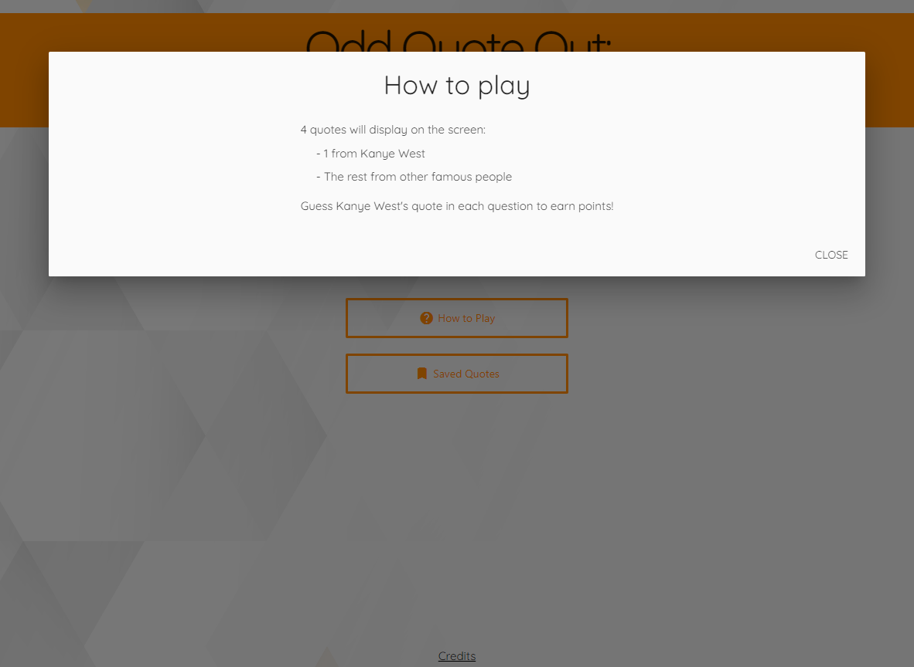
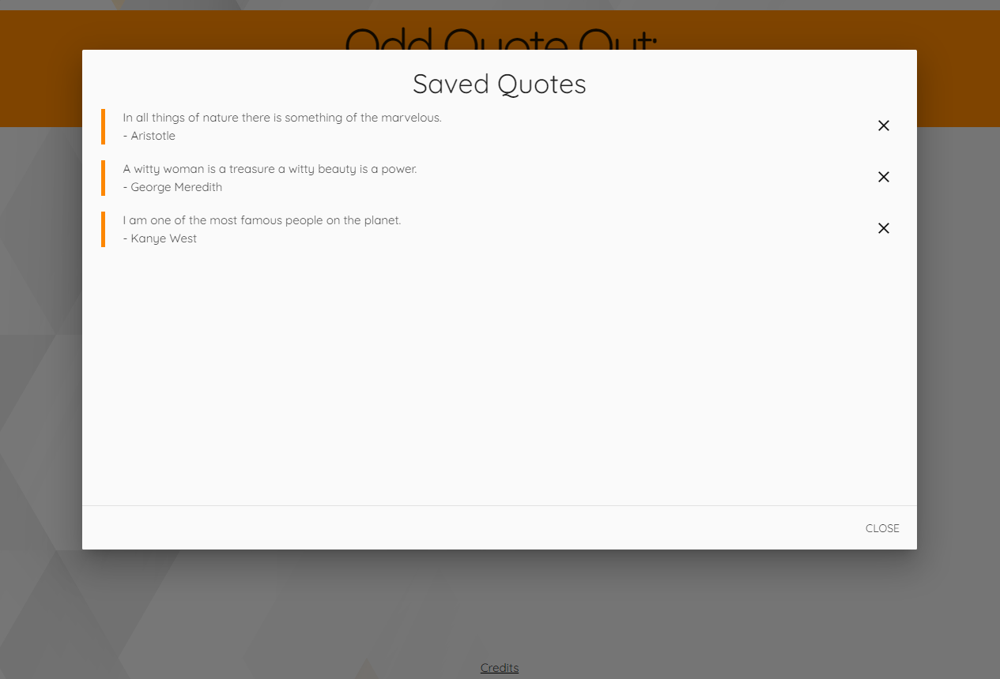
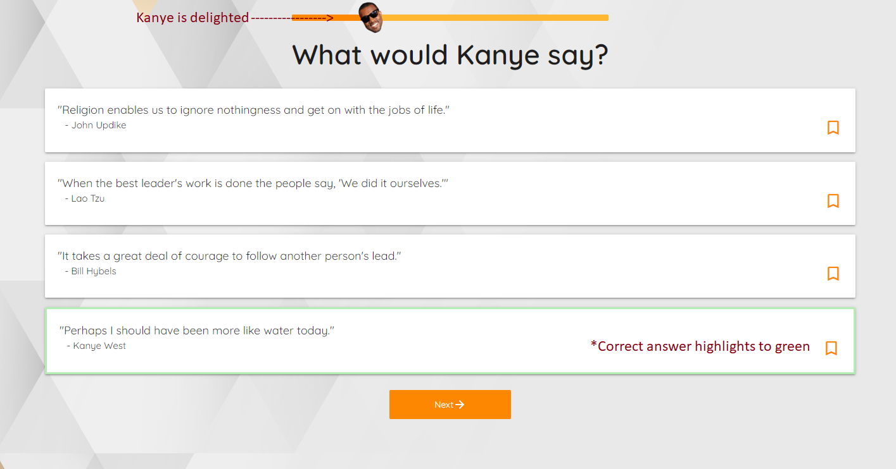
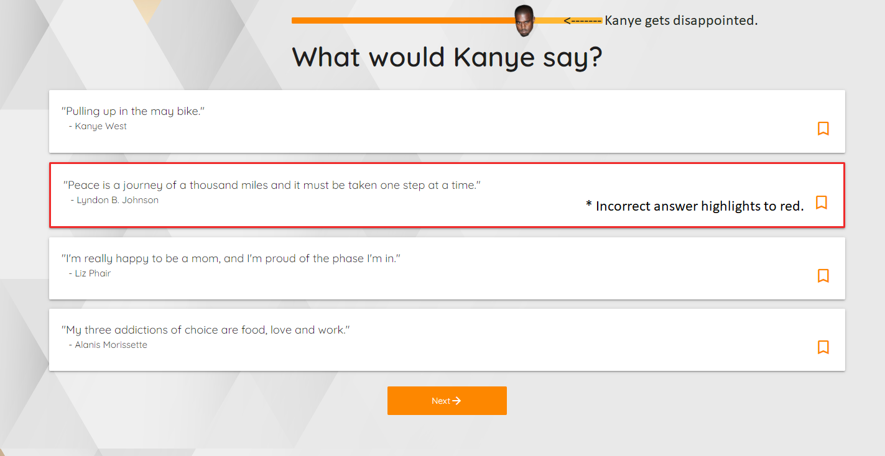
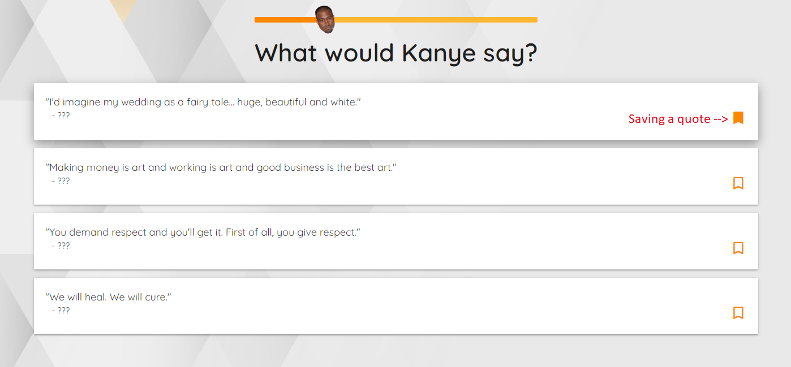
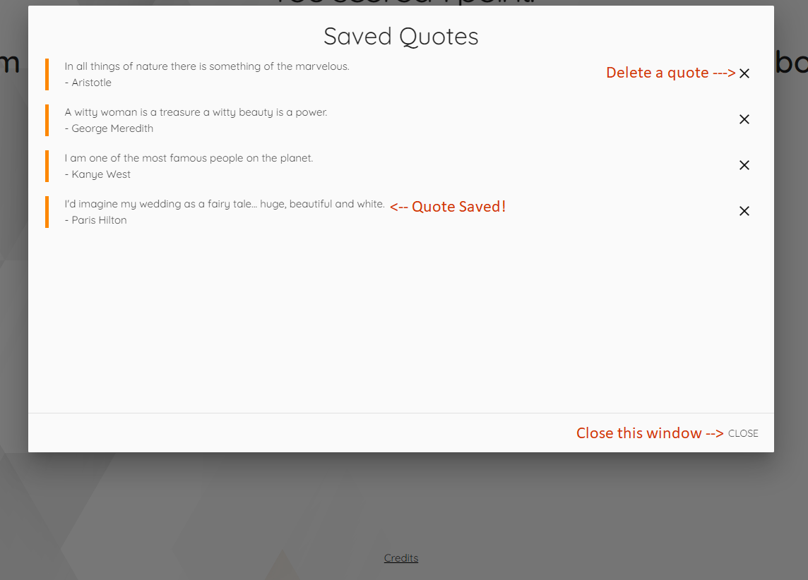

# Odd Quote Out: **Kanye Edition**

## Table of Contents

- [Description](#description)
- [Installation](#installation)
- [Usage](#usage)
- [Features](#features)
- [Credits](#credits)
- [License](#license)

------------------------------------------------------------------------------------------------------------------------------------------------------------------------------------------------------

## Description

------------------------------------------------------------------------------------------------------------------------------------------------------------------------------------------------------

We have developed an odd quote out quiz game for the purpose of entertainment, that includes Kanye's quotes and other quotes said by famous people, and the player would get to choose what they think is the odd one out of the choices on the screen and see how many they get right. The main purpose of the game is entertainment, but it can also  be used to challenge oneself and expand their knowledge of quotes. The idea behind the game is to expand our game to include educational quotes and inspirational other quotes said by other aspiring famous people.

------------------------------------------------------------------------------------------------------------------------------------------------------------------------------------------------------

## Installation

The URL will mostly work in all browsers. The preferred Browser is Google Chrome and the extension Chrome DevTools Extension to view the source code. GitHub is a cloud service for projects/repositories. You can simply visit the URL to view the repository in your browser:-

[GitHub Repo: Odd Quote Out: Kanye Edition](https://github.com/iab-19/odd_quote_out_kanye_edition)

------------------------------------------------------------------------------------------------------------------------------------------------------------------------------------------------------

## Usage

------------------------------------------------------------------------------------------------------------------------------------------------------------------------------------------------------

[Visit Odd Quote Out: Kanye Edition](https://iab-19.github.io/odd_quote_out_kanye_edition/)

### The players can navigate using the 3 buttons on the homepage

------------------------------------------------------------------------------------------------------------------------------------------------------------------------------------------------------

------------------------------------------------------------------------------------------------------------------------------------------------------------------------------------------------------

### The play button will start the quiz and present choices, as shown below

------------------------------------------------------------------------------------------------------------------------------------------------------------------------------------------------------

------------------------------------------------------------------------------------------------------------------------------------------------------------------------------------------------------

### The 'How to Play' button includes the instructions and opens a small window as

------------------------------------------------------------------------------------------------------------------------------------------------------------------------------------------------------

------------------------------------------------------------------------------------------------------------------------------------------------------------------------------------------------------

### The Saved Quotes Button will navigate the user to the quotes they have saved as they went through the gameplay

------------------------------------------------------------------------------------------------------------------------------------------------------------------------------------------------------

------------------------------------------------------------------------------------------------------------------------------------------------------------------------------------------------------

## Features

------------------------------------------------------------------------------------------------------------------------------------------------------------------------------------------------------

### The user will know when they have given a correct answer as it will turn green and the incorrect answer will turn red :~

------------------------------------------------------------------------------------------------------------------------------------------------------------------------------------------------------

------------------------------------------------------------------------------------------------------------------------------------------------------------------------------------------------------

------------------------------------------------------------------------------------------------------------------------------------------------------------------------------------------------------

### The user can bookmark the quotes they like

------------------------------------------------------------------------------------------------------------------------------------------------------------------------------------------------------

### Bookmark a quote & ### View/Delete Quotes

------------------------------------------------------------------------------------------------------------------------------------------------------------------------------------------------------

------------------------------------------------------------------------------------------------------------------------------------------------------------------------------------------------------

------------------------------------------------------------------------------------------------------------------------------------------------------------------------------------------------------

## Credits

------------------------------------------------------------------------------------------------------------------------------------------------------------------------------------------------------

[Hafsah Nasreen](https://github.com/hafsah1976?tab=repositories)

[Jacob Medina](https://github.com/jacob-medina)

[Ibrahima Barry](https://github.com/iab-19)

[Saron Kal](https://github.com/saronkal)

------------------------------------------------------------------------------------------------------------------------------------------------------------------------------------------------------

## Resources

------------------------------------------------------------------------------------------------------------------------------------------------------------------------------------------------------

### Server-side APIs used

- [Kanye Rest](https://github.com/ajzbc/kanye.rest/tree/master)
- [Quote Garden](https://pprathameshmore.github.io/QuoteGarden/)

------------------------------------------------------------------------------------------------------------------------------------------------------------------------------------------------------

### Images used

- [Kanye West Head (Neutral)](https://www.nicepng.com/maxp/u2e6r5q8r5q8e6i1/)
- [Kanye West Head (Happy)](https://freepngimg.com/png/16386-kanye-west-png-hd)
- [Kanye West Head (Upset)](https://www.nicepng.com/maxp/u2q8t4y3a9a9t4r5/)
- [Uploaded by Scott Ward](https://freepngimg.com/author/scottward-7902)
- [Kanye Perfection](https://thesource.com/wp-content/uploads/2020/06/GettyImages-1205196725-696x442-1-696x400.jpg)
- [From The Source](https://thesource.com/2023/06/08/happy-46th-birthday-to-kanye-west/Magazine)
- [Kanye's Reaction to Score](https://www.eonline.com/photos/12838/kanye-west-s-most-outrageous-quotes)
- [Gold and silver background image](https://www.freepik.com/free-vector/white-gold-geometric-pattern-background-vector_18717112.htm#query=light%20background&position=9&from_view=keyword&track=ais)
- [Kanye West (Dissapointed)](https://people.com/style/kanye-west-feud-with-adidas-everything-to-know/)
- [Kanye West (Shocked)](https://www.vanityfair.com/style/2016/06/kanye-wests-surprise-nyc-show-leads-to-complete-pandemonium)

------------------------------------------------------------------------------------------------------------------------------------------------------------------------------------------------------

### Web API and Framworks Used

- [jQuery](https://code.jquery.com/jquery-3.7.0.min.js)
- [Materialize](https://materializecss.com/)

#### Google Fonts

- [Font Families](https://fonts.googleapis.com/css2?family=Abel&family=Agdasima&family=Dancing+Script&family=Fasthand&family=Quicksand:wght@400;600;700&family=UnifrakturCook:wght@700&display=swap)

------------------------------------------------------------------------------------------------------------------------------------------------------------------------------------------------------

## License

Permission is hereby granted, free of charge, to any person obtaining a copy of this software and associated documentation files (the “Software”), to deal in the Software without restriction, including without limitation the rights to use, copy, modify, merge, publish, distribute, sublicense, and/or sell copies of the Software, and to permit persons to whom the Software is furnished to do so, subject to the following conditions:

The above copyright notice and this permission notice shall be included in all copies or substantial portions of the Software.

THE SOFTWARE IS PROVIDED “AS IS”, WITHOUT WARRANTY OF ANY KIND, EXPRESS OR IMPLIED, INCLUDING BUT NOT LIMITED TO THE WARRANTIES OF MERCHANTABILITY, FITNESS FOR A PARTICULAR PURPOSE, AND NONINFRINGEMENT. IN NO EVENT SHALL THE AUTHORS OR COPYRIGHT HOLDERS BE LIABLE FOR ANY CLAIM, DAMAGES, OR OTHER LIABILITY, WHETHER IN AN ACTION OF CONTRACT, TORT, OR OTHERWISE, ARISING FROM, OUT OF, OR IN CONNECTION WITH THE SOFTWARE OR THE USE OR OTHER DEALINGS IN THE SOFTWARE.

------------------------------------------------------------------------------------------------------------------------------------------------------------------------------------------------------
